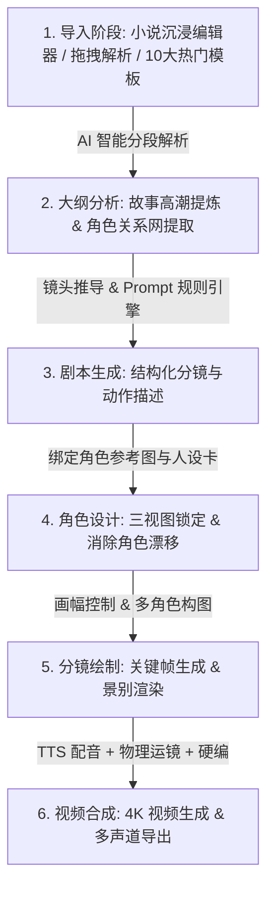

<div align="center">

<picture>
  <source media="(prefers-color-scheme: dark)" srcset="public/mangav_brand_logo.jpg" />
  
</picture>

<br/>

# MangaV (漫织 AI) · Studio v0.0.1

> **输入一本小说，AI 自动精织为 4K 原生视听漫剧 —— 基于 Tauri v2 + React 19 + Rust Engine 的端到端开源桌面应用体系。**

[](https://github.com/Agions/mangav/actions)
[](https://opensource.org/licenses/MIT)
[](https://react.dev)
[](https://tauri.app)
[](https://www.rust-lang.org)
[](https://www.typescriptlang.org)
[](https://github.com/Agions/mangav/releases)

[**📖 在线文档**](https://agions.github.io/mangav/) · [**📥 下载桌面端**](https://github.com/Agions/mangav/releases) · [**🐛 报告问题**](https://github.com/Agions/mangav/issues/new)

</div>

---

## 📖 简介 (Overview)

**MangaV (漫织 AI)** 是一款面向漫剧创作者、短视频博主与影视编导的开源桌面端 **AI 漫剧全流程创作平台**。

平台通过全新的 **6 阶规范 SOP 流水线**，将原著小说或剧本文本自动进行章节切分、高潮提炼、角色设定卡推导、分镜提示词构建、关键帧画面渲染、多角色 TTS 配音合成及 4K 视频导出。内置 13 大 AI 提供商接口，涵盖最新的文字大模型、生图模型与视频生成引擎。

---

## 🌟 核心特性 (Key Features)

| 领域 | 功能特性                    | 详细说明                                                                                                                                                    |
| :--- | :-------------------------- | :---------------------------------------------------------------------------------------------------------------------------------------------------------- |
| 🎬   | **6 阶 SOP 规范工作流**     | 严谨控制 `Import` $\rightarrow$ `Analysis` $\rightarrow$ `Script` $\rightarrow$ `Character` $\rightarrow$ `Storyboard` $\rightarrow$ `Synthesis` 状态机流转 |
| 🤖   | **13 大 AI 提供商全景支持** | 原生对接 DeepSeek-V4/R1, Qwen 3.8-Max, 腾讯 Hy3/Hunyuan-T1, 百度 ERNIE 5.1/5.0, Kimi K3, GPT-5.6 Sol, Claude Opus 5, Gemini 3.6 Flash, 智谱 GLM-5.2 等      |
| 📐   | **三大分类模型矩阵**        | 明确划分 **📝 文字大模型**、**🎨 图片生图模型**（CogView-4 / Seedream 5.0）、**🎬 视频渲染引擎**（可灵 3.0 Omni / Seedance 2.5 / MiniMax H3）               |
| 🔗   | **官方快捷申请入口**        | 系统控制中心提供所有 13 大 AI 开放平台控制台 **一键快捷申请 API Key** 页面直达通道                                                                          |
| 📝   | **沉浸式剧本编辑器**        | 支持文本快捷粘贴、拖拽导入（.txt / .md / .docx）、字数与行数统计、内置 10 套热门漫剧预设模板                                                                |
| 🚀   | **FFmpeg GPU 硬件加速**     | 自动检测并调度 Apple Silicon **VideoToolbox** (Metal GPU) 与 NVIDIA **NVENC** 硬件加速，视频合成导出提升 **40% ~ 70%**                                      |
| 🎙️   | **多音轨 TTS 时间轴**       | 包含对白轨、旁白轨与背景音乐 BGM，毫秒级字幕对齐与音画同步                                                                                                  |
| 🔒   | **100% 本地数据与 Keyring** | API Key 加密存储于系统原生 Keyring，全套分镜与项目工程完全保存在本地目录，无云端数据泄漏风险                                                                |

---

## 📐 6 阶 SOP 漫剧生成流水线 (Standard Pipeline)



---

## 🤖 2026 最新 13 大 AI 提供商与模型矩阵

### 1. 📝 文字大模型 (Text / LLM Models)

- **腾讯混元 Hy3 (`hy3`)**：**2026 最新发布**，256K 超长上下文，极其擅长中文短剧台词创作。
- **腾讯混元 Hunyuan-T1 (`hunyuan-t1-latest`)**：基于 Hybrid-Mamba MoE 架构的深度推理模型。
- **百度文心 ERNIE 5.1 (`ERNIE-5.1`)**：**2026.05 最新旗舰**，强化学习 Agent 剧本创作与逻辑推演。
- **百度文心 ERNIE 5.0 (`ERNIE-5.0`)**：2.4 万亿参数原生全模态大模型。
- **阿里通义千问 Qwen 3.8-Max (`qwen-3.8-max`)**：2026.08 最新 2.4万亿 MoE，100万 Context。
- **DeepSeek-V4-Flash (`deepseek-v4-flash-0731`)**：2026.07.31 最新，极速响应与长剧本拆解。
- **DeepSeek-R1 (`deepseek-reasoner`)**：官方深度推理 CoT 思维链模型。
- **月之暗面 Kimi K3 (`kimi-k3`)**：2.8 万亿 MoE，100万 Context 小说无损解析。
- **OpenAI GPT-5.6 Sol (`gpt-5.6-sol`)**：100万 Context 导演级推理编演。
- **Anthropic Claude Opus 5 (`claude-opus-5`)**：最强剧本润色与 Agent 调度。
- **Google Gemini 3.6 Flash (`gemini-3.6-flash`)**：200万 Context 超长整书理解。
- **科大讯飞 Spark V4.0 Ultra (`generalv4.0`)**：中文古风与漫剧台词对白拟真。
- **智谱 GLM-5.2 (`glm-5.2`)**：长程 Agent 编导调度最佳中文模型。

### 2. 🎨 图片生图模型 (Image Models)

- **字节 Seedream 5.0 (`doubao-seedream-5.0`)**：4K 超高精国漫与二次元分镜生成。
- **智谱 CogView-4 Pro (`cogview-4-pro`)**：4K 中文修仙与赛博风格生图。
- **快手可灵 Image V2.5 (`kling-image-v2.5`)**：9 宫格连贯画幅与景别锁定。
- **阿里通义万相 2.5 (`wanx-v2.5`)**：3D 国漫与唯美古风生图。
- **腾讯混元 DiT V2 (`hunyuan-dit-v2`)**：角色服饰一致性与镜头景深虚化。

### 3. 🎬 视频渲染引擎 (Video Models)

- **快手可灵 3.0 Omni (`kling-3.0-omni`)**：原生 4K 60fps 电影级画质与 Pan/Zoom 物理运镜。
- **字节 Seedance 2.5 (`seedance-2.5`)**：30 秒连续视频生成与 50 种参考资产控制。
- **MiniMax H3 (`minimax-h3`)**：15 秒 2K 原生双声道立体声视频生成。
- **智谱 CogVideoX 2.5 (`cogvideox-2.5`)**：10 秒 4K 高精运镜与 3D 摄像机微动视差。
- **腾讯混元 Video Pro (`hunyuan-video-pro`)**：打斗动作特写与技能粒子光效镜头。

---

## 🏗️ 系统架构设计 (Architecture Overview)

```
mangav/
├── packages/                     # 6 大前端 TypeScript/React 模块 (pnpm workspace)
│   ├── core/                     # @mangav/core — 领域模型与 WorkflowEngine 状态机
│   ├── ai-engine/                # @mangav/ai-engine — 13 大 AI Provider 与 ModelCatalog
│   ├── storyboard/               # @mangav/storyboard — NovelImporter 沉浸编辑器与 StoryboardGrid
│   ├── audio-studio/             # @mangav/audio-studio — AudioStudio 多音轨 TTS 工作台
│   ├── render-pipeline/          # @mangav/render-pipeline — 硬件加速渲染控制台与 Hooks
│   └── ui/                       # @mangav/ui — 赛博朋克极暗 Design System 组件库
├── crates/                       # 6 大 Rust Native Crate (Cargo workspace)
│   ├── core/                     # mangav-core — 项目持久化 (ProjectStore) 与 Keyring
│   ├── ai/                       # mangav-ai — NovelScriptParser 剧本拆解与镜头推导
│   ├── media/                    # mangav-media — FFmpeg 硬件加速与 VideoToolbox/NVENC
│   ├── ipc/                      # mangav-ipc — 强类型 Tauri Command 桥接层
│   ├── plugin/                   # mangav-plugin — WASM 扩展沙盒
│   └── updater/                  # mangav-updater — 自动更新与签名校验
├── src/                          # 应用主入口 (Feature-Sliced Design)
├── src-tauri/                    # Tauri v2 桌面壳入口与配置文件
└── scripts/                      # 标准化构建与自动化脚本 (`build-desktop.sh`)
```

---

## 📥 快速开始与安装 (Getting Started)

### 选项一：下载原生桌面安装包

| 平台        | 架构                              | 下载二进制文件                                                                  |
| :---------- | :-------------------------------- | :------------------------------------------------------------------------------ |
| **macOS**   | Universal (Apple Silicon / Intel) | [MangaV.app (DMG)](https://github.com/Agions/mangav/releases/latest)            |
| **Windows** | x64                               | [mangav_x64-setup.exe (NSIS)](https://github.com/Agions/mangav/releases/latest) |
| **Windows** | ARM64                             | [mangav_arm64-setup.exe](https://github.com/Agions/mangav/releases/latest)      |
| **Linux**   | x64                               | [mangav_amd64.deb](https://github.com/Agions/mangav/releases/latest)            |

### 选项二：源码克隆与本地开发

```bash
# 1. 克隆代码库
git clone https://github.com/Agions/mangav.git
cd mangav

# 2. 安装项目依赖
pnpm install

# 3. 启动开发模式 (Vite Dev + Tauri Desktop)
pnpm tauri dev

# 4. 执行标准化桌面端编译打包
bash scripts/build-desktop.sh
```

---

## 🛠️ 环境变量与 Key 配置

应用内部集成了密钥管理器，您也可在 `.env.local` 文件中预置常用的 API Key：

```bash
# 文字大模型 Key
VITE_DEEPSEEK_API_KEY=your_deepseek_key
VITE_ZHIPU_API_KEY=your_zhipu_key
VITE_OPENAI_API_KEY=your_openai_key

# 生图与视频引擎 Key
VITE_KLING_API_KEY=your_kling_key
VITE_SEEDDREAM_API_KEY=your_bytedance_key
```

---

## 📄 许可证 (License)

[MIT License](LICENSE) © 2026 **MangaV Team**
