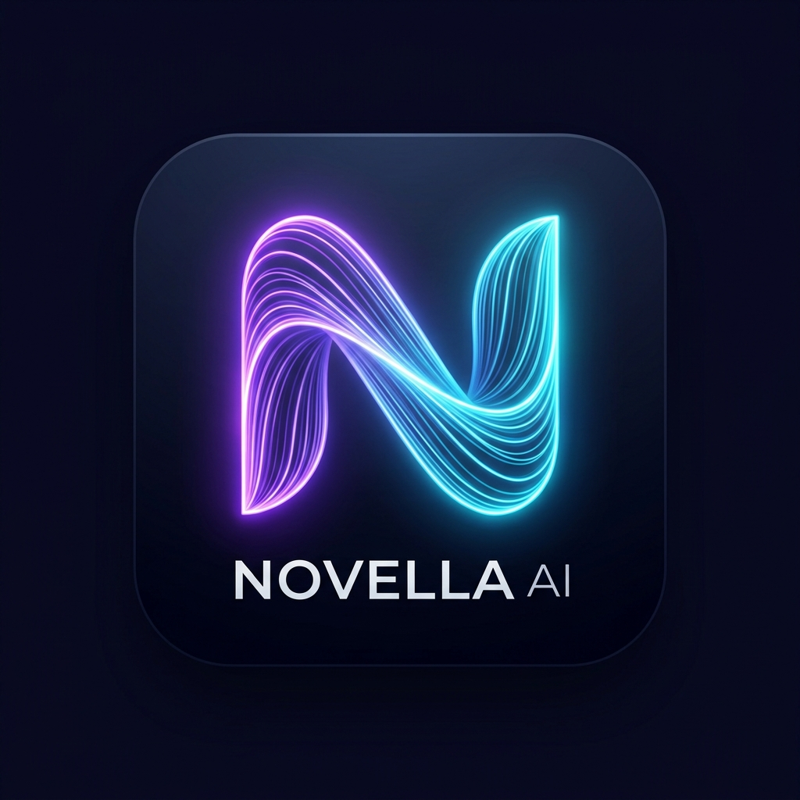
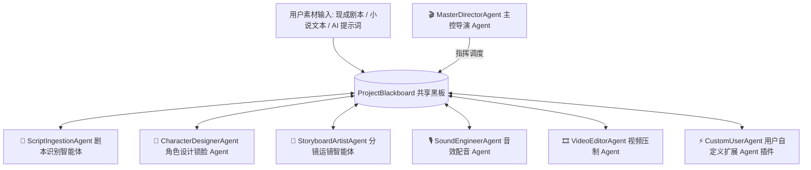

<div align="center">

<picture>
  <source media="(prefers-color-scheme: dark)" srcset="public/novella_brand_logo.jpg" />
  
</picture>

<br/>

# Novella (Novella AI) · Studio v0.0.1 (Multi-Agent Edition)

> **输入剧本、小说或 AI 提示词，Multi-Agent 智能体集群自动协同精织为 4K 原生视听漫剧 —— 基于 Tauri v2 + React 19 + Rust Engine 的端到端开源桌面应用体系。**

[](https://github.com/Agions/novella/actions)
[](https://opensource.org/licenses/MIT)
[](https://github.com/Agions/novella)
[](https://react.dev)
[](https://tauri.app)
[](https://www.rust-lang.org)

[**📖 在线文档**](https://agions.github.io/novella/) · [**📥 下载桌面端**](https://github.com/Agions/novella/releases) · [**🐛 报告问题**](https://github.com/Agions/novella/issues/new)

</div>

---

## 📖 简介 (Overview)

**Novella (Novella AI)** 是一款面向漫剧创作者、短视频博主与影视编导的开源桌面端 **Multi-Agent 多智能体协作漫剧创作平台**。

项目重构废除了原有的单向线性 SOP，采用全新的 **Hub-and-Spoke 多智能体协作架构** 与 **ProjectBlackboard 共享黑板模式**。支持现成剧本文件、小说文本与 AI 创作提示词三类素材输入，由主控导演智能体 (`MasterDirectorAgent`) 协调各专门智能体（剧本识别、角色设计锁脸、分镜运镜规划、音效 TTS 配音、4K 视频压制）与用户自定义扩展 Agent 协同完成从原始文本到 4K 漫剧视频的全自动化推导。

---

## 🌟 核心特性 (Key Features)

| 领域 | 功能特性 | 详细说明 |
| :--- | :--- | :--- |
| 🤖 | **Hub-and-Spoke 多智能体架构** | 摒弃线性 SOP，采用以 `ProjectBlackboard` 为核心的 Hub-and-Spoke 多智能体解耦协作体系 |
| 📄 | **全输入类型智能介入** | 原生支持 **现成剧本文件 (.txt/.md/.docx/.json)**、**小说原文章节文本**与 **AI 创作提示词** 三类输入自动解析 |
| ⚡ | **自定义 Agent 扩展插件** | 声明式自定义 Agent 体系，支持用户在 UI 界面一键注册自定义 Agent（定义名称、触发阶段如剧本后/分镜后、系统 Prompt） |
| 🎬 | **零二次上传无缝流转** | 工作台一键推导后，无缝保存并载入分镜编辑器大盘（`Step 3`），无需重复粘贴或上传剧本素材 |
| 👤 | **Master Consistency 锁脸** | 自动提取角色实体并生成人设 Prompt 与 IP-Adapter Consistent Anchor，有效消除二次元角色漂移 |
| 📐 | **三大分类 AI 模型矩阵** | 对接 13 大 AI 提供商，涵盖文字大模型（DeepSeek-V4/R1, Qwen 3.8-Max, 混元 Hy3 等）、生图与 4K 视频引擎 |
| 🚀 | **GPU 4K 硬件加速压制** | 自动调度 Apple Silicon **VideoToolbox** (Metal GPU) 与 NVIDIA **NVENC** 硬件加速，导出效率提升 40% ~ 70% |
| 🔒 | **100% 本地数据与 Keyring** | API Key 加密存储于系统原生 Keyring，工程数据全量保存在本地，无云端数据泄漏风险 |

---

## 🏗️ Multi-Agent 多智能体协作架构 (Multi-Agent Architecture)



### 智能体分工与职责 (Agent Roles)

1. **`MasterDirectorAgent` (主控导演智能体)**：调度枢纽，监听 Blackboard 共享黑板状态，指挥子 Agent 分发任务并管控流转全过程。
2. **`ScriptIngestionAgent` (剧本识别智能体)**：自动识别剧本文件、小说文本与 AI 提示词，分段提取章节大纲与分镜场景。
3. **`CharacterDesignerAgent` (角色设计智能体)**：提炼角色实体，绑定 Consistency LoRA 锁脸 Anchor 锚点与 TTS 音色。
4. **`StoryboardArtistAgent` (分镜绘图智能体)**：规划镜头轨迹 (Zoom / Tilt) 与高清动画 Prompt，构建 3 栏漫剧画幅大盘。
5. **`SoundEngineerAgent` (音效配音智能体)**：多音轨 EdgeTTS / CosyVoice 合成与毫秒级字幕卡点计算。
6. **`VideoEditorAgent` (视频压制智能体)**：Apple VideoToolbox / NVENC GPU 4K 硬件加速压制与渲染队列调度。
7. **`CustomUserAgent` (用户自定义 Agent)**：用户可自定义声明扩展 Agent（配置 Prompt、触发阶段如「剧本后/分镜后/音频后」），共享 Blackboard 黑板流转。

---

## 🧩 自定义 Agent 扩展指南 (Custom Agent Extension Guide)

您可以方便地在 UI 设置界面或通过代码扩展自定义 Agent：

### 界面一键扩展：
1. 打开 **Multi-Agent 多智能体创作中心**；
2. 点击右上角 **【+ 扩展自定义 Agent】** 按钮；
3. 填入 Agent 名称、图标 Emoji、触发阶段（例如：`2. 剧本解析后`）与自定义系统 Prompt；
4. 点击保存，调度中心自动将其纳入 `AgentRegistry` 与共享黑板推导链中！

---

## 🤖 2026 最新 13 大 AI 提供商与模型矩阵

### 1. 📝 文字大模型 (Text / LLM Models)
- **腾讯混元 Hy3 (`hy3`)**：**2026 最新发布**，256K 超长上下文，极其擅长中文短剧台词创作。
- **腾讯混元 Hunyuan-T1 (`hunyuan-t1-latest`)**：基于 Hybrid-Mamba MoE 架构的深度推理模型。
- **百度文心 ERNIE 5.1 (`ERNIE-5.1`)**：**2026.05 最新旗舰**，强化学习 Agent 剧本创作与逻辑推演。
- **阿里通义千问 Qwen 3.8-Max (`qwen-3.8-max`)**：2026.08 最新 2.4万亿 MoE，100万 Context。
- **DeepSeek-V4-Flash (`deepseek-v4-flash-0731`)**：2026.07.31 最新，极速响应与长剧本拆解。
- **DeepSeek-R1 (`deepseek-reasoner`)**：官方深度推理 CoT 思维链模型。
- **月之暗面 Kimi K3 (`kimi-k3`)**：2.8 万亿 MoE，100万 Context 小说无损解析。
- **OpenAI GPT-5.6 Sol (`gpt-5.6-sol`)**：100万 Context 导演级推理编演。

### 2. 🎨 图片与视频引擎 (Image & Video Models)
- **字节 Seedream 5.0 (`doubao-seedream-5.0`)**：4K 超高精国漫与二次元分镜生成。
- **快手可灵 3.0 Omni (`kling-3.0-omni`)**：原生 4K 60fps 电影级画质与 Pan/Zoom 物理运镜。
- **字节 Seedance 2.5 (`seedance-2.5`)**：30 秒连续视频生成与 50 种参考资产控制。

---

## 📥 快速开始与安装 (Getting Started)

```bash
# 1. 克隆代码库
git clone https://github.com/Agions/novella.git
cd novella

# 2. 安装项目依赖
pnpm install

# 3. 启动开发模式 (Vite Dev + Tauri Desktop)
pnpm tauri dev

# 4. 执行标准化桌面端编译打包
bash scripts/build-desktop.sh
```

---

## 📄 许可证 (License)

[MIT License](LICENSE) © 2026 **Novella Team**
