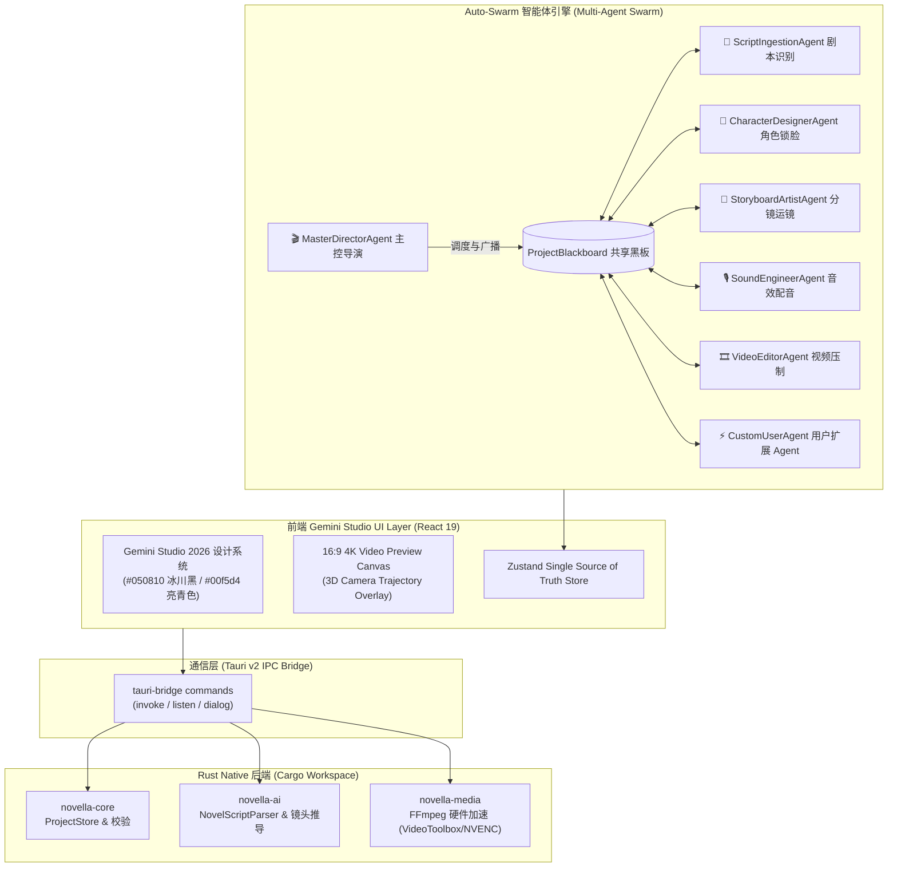

# Novella (Novella AI) 系统架构设计说明书 (Gemini Studio Auto-Swarm Edition)

> **设计目标**: 构建企业级、可扩展、解耦的 Auto-Swarm AI 漫剧桌面创作平台，支撑从小说/剧本/提示词导入到 4K 视频导出的全流程多智能体自动化。

---

## 1. 架构总览 (High-Level Architecture)

`Novella` 采用了 **pnpm workspace (前端)** + **Cargo workspace (Rust 后端)** + **Auto-Swarm Multi-Agent Engine (智能体引擎)** 的解耦架构：

---

## 2. Auto-Swarm 多智能体集群分工 (Swarm Roles)

| 智能体 | 标识符 | 核心职责 |
| :--- | :--- | :--- |
| **`MasterDirectorAgent`** | `CHIEF` | Hub-and-Spoke 调度中心，监听 `ProjectBlackboard` 共享黑板，负责任务下发、打回与 Auto-Retry 自动纠错 Loop。 |
| **`ScriptIngestionAgent`** | `SCRIPT` | 识别小说文本、剧本文件与 AI 提示词，提取高潮场景与结构化分场 JSON。 |
| **`CharacterDesignerAgent`** | `DESIGNER` | 提取角色实体，绑定 Consistency Anchor 锁脸 LoRA 与角色音色。 |
| **`StoryboardArtistAgent`** | `ARTIST` | 推导镜头运动矢量 (Zoom/Tilt/Pan)，渲染 FLUX 4K 画幅。 |
| **`SoundEngineerAgent`** | `SOUND` | 多声道 EdgeTTS / CosyVoice 合成与毫秒级字幕卡点计算。 |
| **`VideoEditorAgent`** | `VIDEO` | 调起 Apple VideoToolbox / NVENC GPU 4K 硬件加速压制。 |
| **`CustomUserAgent`** | `CUSTOM` | 允许用户在 UI 界面声明式一键注册自定义 Agent 扩展。 |

---

## 3. 4 大核心环节流水线 (4 Core Phases)

1. **策划设定 (`Phase 1: Character Anchor`)**：剧本解析与角色 Consistency 锁脸；
2. **画面生成 (`Phase 2: 3-Column Storyboard`)**：4K 动漫分镜画幅大盘与 FLUX 生图；
3. **动态合成 (`Phase 3: 3D Camera Motion Overlay`)**：16:9 4K 视听 Preview 画布与 3D 运镜轨迹矢量 Overlay 指针；
4. **声音后期 (`Phase 4: TTS & 4K Export`)**：多音轨 TTS 混音与 GPU 硬件压制。
