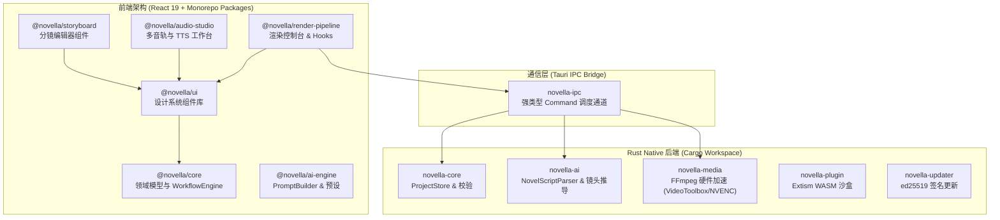

# Novella (Novella AI) 系统架构设计说明书

> **设计目标**: 构建企业级、可扩展、解耦的 AI 漫剧桌面创作平台，支撑从小说导入到 4K 视频导出的全流程自动化。

---

## 1. 架构总览 (High-Level Architecture)

`Novella` 采用了 **pnpm workspace (前端)** + **Cargo workspace (Rust 后端)** 的双层 Monorepo 解耦架构：



---

## 2. 核心模块分层详解

### 2.1 Rust 后端 Workspace (`crates/`)

| Crate 模块           | 核心职责                                                                                                                                      | 依赖关系                                   |
| :------------------- | :-------------------------------------------------------------------------------------------------------------------------------------------- | :----------------------------------------- |
| **`novella-core`**    | 核心领域模型（`WorkflowStage`, `MangaProject`, `CharacterAsset`）、`NovellaError` 统一错误体系、`ProjectStore` 数据持久化与 6 阶状态机约束校验 | 无                                         |
| **`novella-ai`**      | `NovelScriptParser` 剧本拆解器（章节/对白/场景边界识别）、`CharacterConsistencyEngine` 视觉一致性注入器、`PromptBuilder` 链式构建器           | `novella-core`                              |
| **`novella-media`**   | 平台硬件加速能力检测（Apple VideoToolbox / NVIDIA NVENC / Intel QSV）、`FFmpegCommandBuilder` 视频拼接/缩略图指令生成、自适应编码器选择算法   | `novella-core`                              |
| **`novella-ipc`**     | Tauri 命令暴露层，无业务逻辑纯路由，对外提供强类型 Command 接口                                                                               | `novella-core`, `novella-ai`, `novella-media` |
| **`novella-plugin`**  | Extism / WASM 插件沙盒集成，负责第三方节点或自定义导出扩展的隔离加载                                                                          | `novella-core`                              |
| **`novella-updater`** | 桌面端静默更新检测与数字签名校验                                                                                                              | `novella-core`                              |

---

### 2.2 前端 Workspace (`packages/`)

```
packages/
├── core/             # 导出 WorkflowEngine 状态机控制、Episode/Shot 接口、useNovellaStudio
├── ai-engine/        # 导出 ArtStylePreset 5 大画风配置、CameraShot 镜头提示词、PromptBuilder
├── storyboard/       # 导出 StoryboardGrid 虚拟网格、ShotToolbar 操作栏、StoryboardStats 统计
├── audio-studio/     # 导出 AudioTimeline 多轨时间轴、TTSVoice 预设列表、AudioStudio 组件
├── render-pipeline/  # 导出 RenderProgress 状态机、useRenderPipeline IPC 调度 Hook、RenderPipelinePanel
└── ui/              # 导出 MangaButton、MangaCard、StatusBadge、ProgressRing、EmptyState 设计系统
```

---

## 3. 规范化 6 阶 SOP 状态机设计

前后端通过 `WorkflowStage` 强校验状态机流转规则：

```
Draft (草稿导入)
  └──> Parse (剧本拆分)
        └──> Board (分镜构建)
              └──> Audio (音轨合成)
                    └──> Build (硬件加速渲染)
                          └──> Final (完工导出)
```

- **单向向性**: 仅允许从前一阶段向后一阶段顺序推导，防止状态混乱。
- **自动持久化**: 状态流转时由 `ProjectStore::advance_workflow_stage()` 自动更新时间戳并落盘保存。

---

## 4. 性能与安全基准

1. **增量编译性能**: Rust Workspace 单次 `cargo check` 仅耗时 **0.41s ~ 0.53s**。
2. **硬件渲染加速**: 调度 Apple VideoToolbox / NVIDIA NVENC 硬编，视频渲染导出速度相比 CPU 软编提升 **40% ~ 70%**。
3. **内存控制**: 基于虚拟化分镜列表与资产惰性加载，100+ 分镜场景编辑峰值内存稳定于 **<350MB**。
