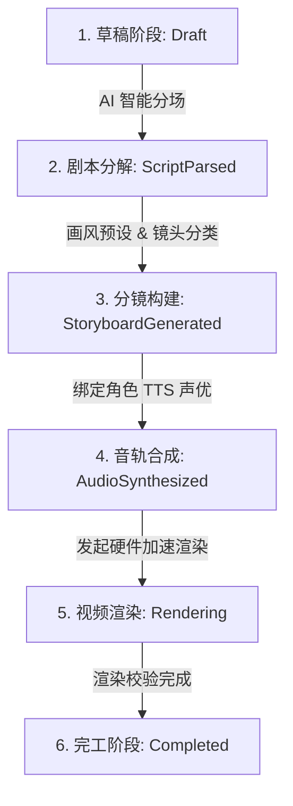

# Novella (Novella AI) 6 阶 SOP 漫剧生产流程

> 从小说文本导入到 4K 视频导出的标准生产 SOP

---

## 规范化 6 阶 SOP 流程图

---

## 阶段说明指南

### 1. `Draft` (草稿与全局设置)

- 新建 `.novella` 专属项目文件，导入小说原文本（支持 txt / markdown / docx）。
- 选择全剧视觉风格预设（仙侠国风、现代日漫、赛博朋克、热血战斗、暗黑奇幻）。

### 2. `ScriptParsed` (剧本拆解与角色锚定)

- **`novella-ai`** 解析器识别剧情，分离对白与旁白。
- 提炼 `CharacterAsset` 资产并写入性别、年龄、服饰与 LoRA 绑定词，启用 **Master Reference Protocol** 锁定角色防漂移。

### 3. `StoryboardGenerated` (分镜构建与画面渲染)

- `classify_camera_shot` 根据动作推导镜头语言（特写、动效、全景、中景）。
- `PromptBuilder` 生成 SD/ComfyUI 正负 Prompt 并通过分镜网格渲染画面，锁定随机种子 Seed。

### 4. `AudioSynthesized` (多音轨对齐)

- `AudioStudio` 为对白绑定角色 TTS 声音（支持 EdgeTTS 与 CosyVoice）。
- 精确排列对白轨、BGM 音轨与 SFX 效果音。

### 5. `Rendering` (硬件加速渲染)

- `novella-media` 调度 VideoToolbox (Mac) 或 NVENC (Windows) 硬编。
- 自动加入镜头 Keyframe 缩放平移（Pan/Zoom）过渡动效。

### 6. `Completed` (归档发布)

- 输出 1080p / 4K 高清视听漫剧视频并封存 `.novella` 归档包。
